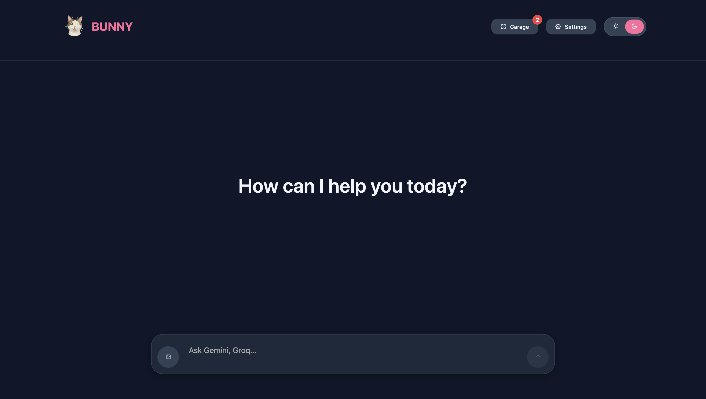

# 😺 BUNNY AI Unispace

 

A web application that allows users to connect to multiple AI services (like Gemini, ChatGPT, Claude) and query them simultaneously from a single interface.

**Live Demo Link:** [https://bunny-unispace.netlify.app](https://bunny-ai-demo.netlify.app/) *(You'll get this link in the next step!)*

---
This project was built to explore modern web development concepts and interact with various third-party AI APIs. The goal was to create a clean, responsive, and functional interface for comparing outputs from different large language models and have a interactive ai system named "garage' Where user can assign roles multiple ai to interact with each other to provide a better solution to user.

### ## Built With

* **React**
* **Vite**
* **TypeScript**
* **CSS Modules / Custom Properties**
* **Axios** for API requests
* **React Hot Toast** for notifications
---